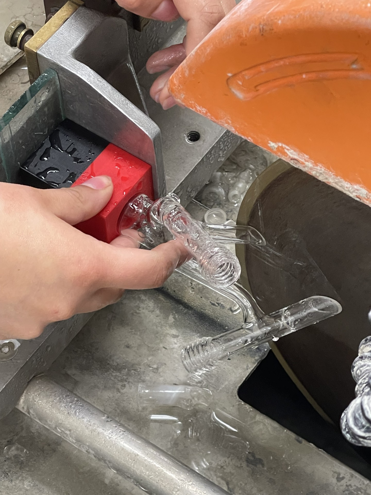
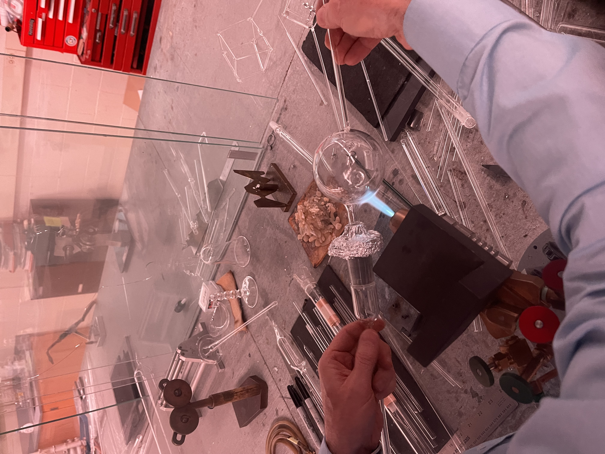
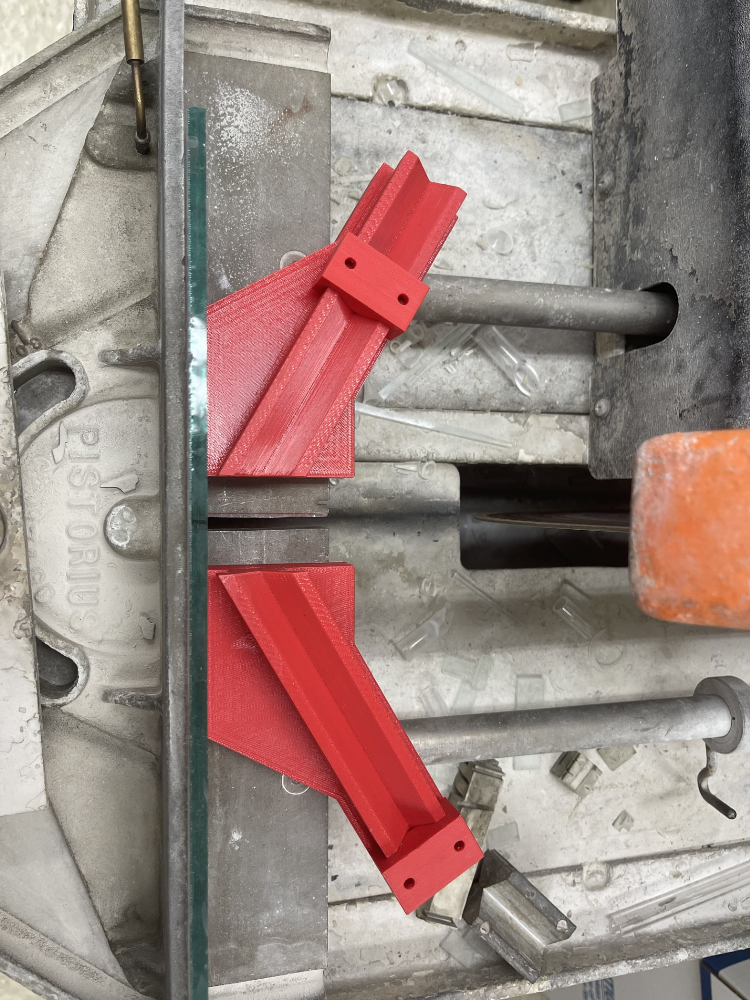

# glassblowing-printables

3D printed designs meant as accessories for scientific glassblowing.

Designed using [solidworks](https://www.solidworks.com/), with generated STL files for your convinience.

Download the STL files and use them in your own 3D printer or with a 3D printing service, such as [craftcloud](https://craftcloud3d.com/).

## Cutting Fixture

For holding parts in the saw.

## Thread and Taper

For holding parts in the torch.

The adapters are "CuttingFixture.SLDPRT" and "thread and taper adapter.SLDPRT" which reference the "thread and taper adapter parameters.txt".
This .txt can be generated using "equationsGenerator.py" to fit with a variety of standard glass tapers and GL threads.
There is a limitation with the parameters, the pitch of the threads which must be adjusted manually in the spiral features.
The thread standards used are from https://www.gewinde-normen.de/en/knuckle-thread-din-168.html

## V Block

For holding tubestock in the saw at certain angles.

 
The V Block files are "VBlockParameterized.SLDPRT" and "vBlockStops.SLDPRT" which reference "VBlockEquations.txt".
The limitation of the parameterization is the holes in the top of the "vBlockStops.SLDPRT" which should be resized to fit different bolts.
The posted models use a M5x.8 tap hole.
VBlocks also have a hole parallel to the groove that can be tapped with a 1/4-20 thread to mound threaded rod to either extend the length or attach a flag.
 
## Credit

Ideas by Lauren Aria.

3D Designs by Sebastian Thompson and Sam Shields.

